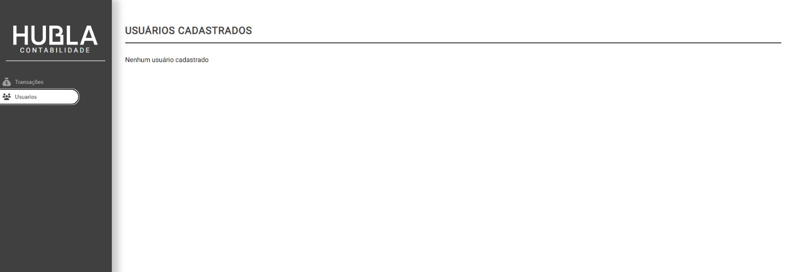

## About the project (EN)

This project is part of the challenge of the selection process for the Software Engineer - Exclusive for Women at Hubla company

## Used technologies

- ### Frontend

  - Node 18
  - Next.js

- ## Backend
  - Node 18
  - Nest.js
  - MySQL

## Start the project

At the root directory, run the following command:

```bash
docker compose up
```

It exposes the port 3000 and 8080 (by default) for the backend and frontend respectively.

After setting up through Docker, just go to _http://localhost:8080_

## Project notes

### Infer information from the file

If you observe closely, by looking at the example file, you can infer who is the creator and who is the affiliate. That said, this project is built on that, where each user has a Role (affiliate or creator).

### Processing of the file

The processing of the file is entirely done on the backend. This allows us to easily create user entities for each newly found user on the transaction file. This gives us more control to see the users and their transactions and affiliates/creators and so on.

## Code organization

```
Source/
├── docker-compose.yml
├── backend/
│   ├── Dockerfile
│   └── src/
│       ├── plugins
│       ├── main.ts
│       └── modules /
│           ├── database/
│           │   ├── database.module.ts
│           │   └── database.service.ts
│           ├── transaction/
│           │   ├── transaction.controller.ts
│           │   ├── transaction.module.ts
│           │   ├── transaction.entity.ts
│           │   ├── transaction.service.ts
│           │   └── transaction.provider.ts
│           └── user/
│               ├── user.controller.ts
│               ├── user.module.ts
│               ├── user.entity.ts
│               ├── user.service.ts
│               └── user.provider.ts
├── frontend/
│   ├── Dockerfile
│   └── src/
│       ├── app/
│       │   ├── variables.module.scss
│       │   ├── layout.tsx
│       │   ├── transactions
│       │   └── users
│       ├── assets
│       ├── components/
│       │   ├── container
│       │   ├── sidebar
│       │   └── loading
│       ├── helpers/
│       │   ├── commom.tsx
│       │   └── interfaces.ts
│       ├── service/
│       │   ├── transactions.tsx
│       │   └── users.tsx
│       └── styles.global.scss
└── prompt/
    ├── intructions.md
    └── sales.tsx
```

## Screenshots

### Transactions List _(No transaction selected)_


### Transactions List Empty


### Transaction Selected


### Users List


### Users List Empty


